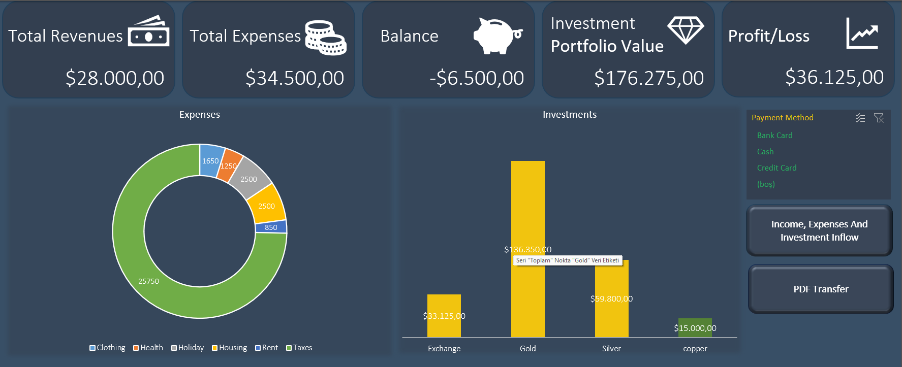

# 📊 Professional Finance & Investment Tracker (VBA)

This project is a sophisticated financial management system developed with **Excel VBA**, utilizing a sustainable and modular software architecture. It is designed not just as a macro file, but as a robust tool that manages revenues, expenses, and investments with professional software principles.

---

## 🚀 Key Features

* **Modular Architecture (Separation of Concerns):** The codebase is strictly organized into functional modules (`Logic`, `Navigation`, `Reports`). This ensures high maintainability and ease of future development.
* **Data Integrity & Validation:** All inputs via the UserForm undergo rigorous validation, including empty field checks, date format verification, and numerical value validation before being committed to the tables.
* **Dynamic Dashboard:** Real-time synchronization is achieved using `RefreshAll` logic, ensuring that all Pivot tables and charts update instantly as data is entered.
* **Automated PDF Reporting:** Converts the Dashboard view into a professional landscape PDF report with a single click, optimized for financial presentations.
* **Activity Log (Recent Transactions):** A dynamic ListBox implementation that tracks and displays the last 10 entries for each financial category in real-time.

---

## 📂 Project Structure & Modules

The system is built on a modular foundation to ensure clean and scalable code:

| Module | Responsibility |
| :--- | :--- |
| **`modLogic`** | The core engine managing data persistence, form resets, and UI updates (ComboBox/ListBox). |
| **`modReports`** | Handles page layouts, printer settings, and PDF export functions. |
| **`modNavigation`** | Controls form initialization and seamless traffic between different data sheets. |
| **`frmFinance`** | A centralized User Interface designed for an optimal and intuitive user experience. |

---

## 🛠️ Installation & Usage

1. Download the `Smart_Finance_V1.xlsm` file.
2. Upon opening, **"Enable Macros"** to allow the VBA engine to function.
3. Use the navigation buttons on the **Dashboard** to launch the entry panel.
4. Enter your data; the system will automatically format (`CCur`, `CDate`) and save it to the respective structured Excel Tables.

---

## 📝 Technical Specifications

* **Language:** VBA (Visual Basic for Applications)
* **Storage:** Excel ListObjects (Structured Tables)
* **Automation:** Dynamic Type Casting & Robust Error Handling.
* **UI/UX:** Advanced MSForms components with a clean, frame-based navigation system.

---

### 🏆 Developer's Note
> This project serves as a proof of concept, demonstrating that VBA—when combined with disciplined software architecture—is a powerful tool for building complex and reliable financial management systems.
